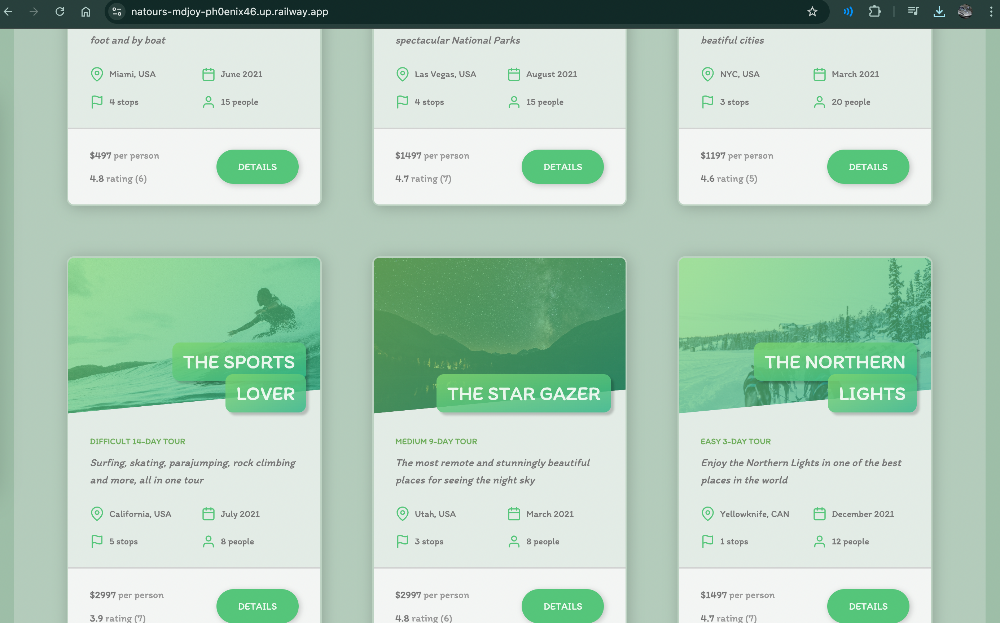
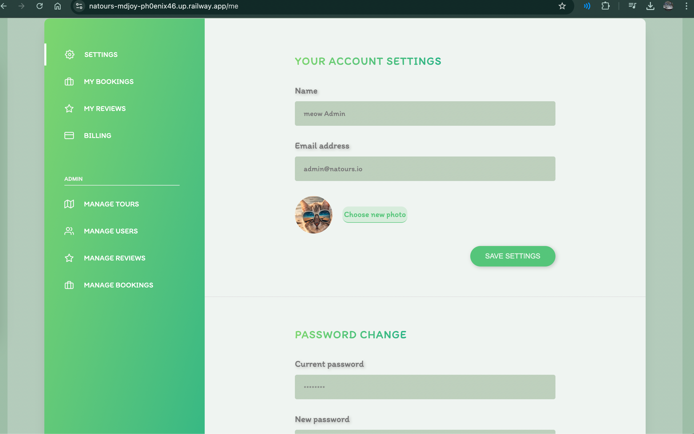
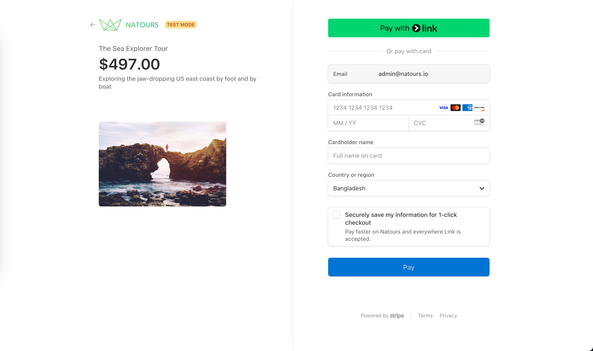
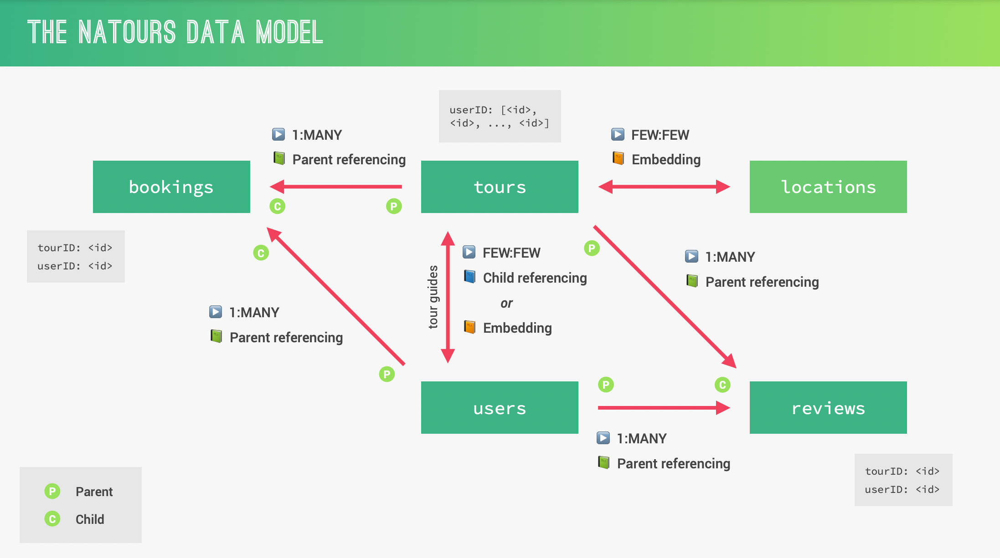

                  


## 𝗧𝗵𝗶𝘀 𝗽𝗿𝝾ᒍ𝗲𝗰𝘁 𝗶𝘀 𝗯𝗮𝘀𝗲𝗱 𝝾𝗻 ᒍ𝝾𝗻𝗮𝘀 𝗦𝗰𝗵𝗺𝗲𝗱𝘁𝗺𝗮𝗻𝗻'𝘀 [𝝢𝗼𝗱𝗲, 𝗘𝘅𝗽𝗿𝗲𝘀𝘀 𝗮𝗻𝗱 𝗺𝗼𝗻𝗴𝗗𝗕](https://www.udemy.com/course/nodejs-express-mongodb-bootcamp/) 𝗰𝝾𝞄𝗿𝘀𝗲. 𝝪𝝾𝞄 𝘀𝗵𝝾𝞄𝗹𝗱 𝗰𝗵𝗲𝗰𝗸 𝗵𝗶𝘀 𝗰𝝾𝞄𝗿𝘀𝗲. 𝝖𝗹𝗹 𝘁𝗵𝗲 𝗰𝗿𝗲𝗱𝗶𝘁𝘀 𝗴𝝾 𝘁𝝾 𝗺𝝲 𝗯𝗲𝗮𝞄𝘁𝗶𝗳𝞄𝗹 𝘁𝗲𝗮𝗰𝗵𝗲𝗿 ᒍ𝝾𝗻𝗮𝘀 𝗦𝗰𝗵𝗺𝗲𝗱𝘁𝗺𝗮𝗻𝗻--

<h1 align="center">
  <br>
  <a href="https://natours-xbsh.onrender.com/"></a>
<br>
  𝝢𝗮𝘁𝗼𝞄𝗿𝘀 𝗪𝗲𝗯𝘀𝗶𝘁𝗲
<br>
</h1>

 <p align="center">
    <a href="https://natours-mdjoy-ph0enix46.up.railway.app/">✅ 𝗩𝗶𝗲𝞈 𝗱𝗲𝗺𝝾</a>
    <br/>
    <a href="https://github.com/pH0enix46/Natours-Website---NODE-EXPRESS-MONGODB/issues">🐛 𝗕𝞄𝗴 𝗿𝗲𝗽𝝾𝗿𝘁</a>
  </p>
  </div>

## 📌 𝗙𝗲𝗮𝘁𝞄𝗿𝗲𝘀  
- **𝗨𝘀𝗲𝗿 𝝖𝞄𝘁𝗵𝗲𝗻𝘁𝗶𝗰𝗮𝘁𝗶𝗼𝗻**: 𝗦𝗶𝗴𝗻 𝞄𝗽, 𝝞𝗼𝗴𝗶𝗻, 𝗮𝗻𝗱 𝘀𝗲𝗰𝞄𝗿𝗲 𝞄𝘀𝗲𝗿 𝗮𝗰𝗰𝗼𝞄𝗻𝘁𝘀 𝞈𝗶𝘁𝗵 𝗝𝗪𝝩 𝗮𝞄𝘁𝗵𝗲𝗻𝘁𝗶𝗰𝗮𝘁𝗶𝗼𝗻
- **𝝩𝗼𝞄𝗿 𝗠𝗮𝗻𝗮𝗴𝗲𝗺𝗲𝗻𝘁**: 𝗩𝗶𝗲𝞈, 𝗰𝗿𝗲𝗮𝘁𝗲, 𝞄𝗽𝗱𝗮𝘁𝗲, 𝗮𝗻𝗱 𝗱𝗲𝝞𝗲𝘁𝗲 𝘁𝗼𝞄𝗿𝘀  
- **𝗕𝗼𝗼𝗸𝗶𝗻𝗴 𝗦𝝲𝘀𝘁𝗲𝗺**: 𝗕𝗼𝗼𝗸 𝘁𝗼𝞄𝗿𝘀 𝗮𝗻𝗱 𝗺𝗮𝗻𝗮𝗴𝗲 𝗿𝗲𝘀𝗲𝗿𝝼𝗮𝘁𝗶𝗼𝗻𝘀  
- **𝗦𝘁𝗿𝗶𝗽𝗲 𝗣𝗮𝝲𝗺𝗲𝗻𝘁 𝗜𝗻𝘁𝗲𝗴𝗿𝗮𝘁𝗶𝗼𝗻**: 𝗦𝗲𝗰𝞄𝗿𝗲 𝗼𝗻𝝞𝗶𝗻𝗲 𝗽𝗮𝝲𝗺𝗲𝗻𝘁𝘀 𝞄𝘀𝗶𝗻𝗴 **𝗦𝘁𝗿𝗶𝗽𝗲** 
- **𝗥𝗼𝝞𝗲-𝗕𝗮𝘀𝗲𝗱 𝝖𝗰𝗰𝗲𝘀𝘀**: 𝗨𝘀𝗲𝗿𝘀 𝗰𝗮𝗻 𝗯𝗼𝗼𝗸 𝘁𝗼𝞄𝗿𝘀; 𝗮𝗱𝗺𝗶𝗻𝘀 𝗰𝗮𝗻 𝗺𝗮𝗻𝗮𝗴𝗲 𝞄𝘀𝗲𝗿𝘀, 𝘁𝗼𝞄𝗿𝘀, 𝗮𝗻𝗱 𝗯𝗼𝗼𝗸𝗶𝗻𝗴𝘀  
- **𝗥𝗘𝗦𝝩𝗳𝞄𝝞 𝝖𝗣𝗜**: 𝝖𝗣𝗜 𝗲𝗻𝗱𝗽𝗼𝗶𝗻𝘁𝘀 𝗳𝗼𝗿 𝗺𝗮𝗻𝗮𝗴𝗶𝗻𝗴 𝞄𝘀𝗲𝗿𝘀, 𝘁𝗼𝞄𝗿𝘀, 𝗮𝗻𝗱 𝗯𝗼𝗼𝗸𝗶𝗻𝗴𝘀  
- **𝗣𝞄𝗴 𝝩𝗲𝗺𝗽𝝞𝗮𝘁𝗶𝗻𝗴**: 𝗗𝝲𝗻𝗮𝗺𝗶𝗰, 𝗿𝗲𝘀𝗽𝗼𝗻𝘀𝗶𝝼𝗲 𝗽𝗮𝗴𝗲𝘀 𝞄𝘀𝗶𝗻𝗴 **𝗣𝞄𝗴**  
- **𝗠𝗼𝗻𝗴𝗼𝗗𝗕 𝗗𝗮𝘁𝗮𝗯𝗮𝘀𝗲**: 𝗗𝗮𝘁𝗮 𝘀𝘁𝗼𝗿𝗲𝗱 𝗮𝗻𝗱 𝗺𝗮𝗻𝗮𝗴𝗲𝗱 𝞄𝘀𝗶𝗻𝗴 **𝗠𝗼𝗻𝗴𝗼𝗼𝘀𝗲** 
- **𝗛𝗼𝘀𝘁𝗶𝗻𝗴**: 𝗗𝗲𝗽𝝞𝗼𝝲𝗲𝗱 𝗼𝗻 **𝗥𝗮𝗶𝝞𝞈𝗮𝝲**







## 💳 𝗗𝗲𝗺𝗼 𝗣𝗮𝝲𝗺𝗲𝗻𝘁 𝗮𝗻𝗱 𝝖𝗰𝗰𝗼𝞄𝗻𝘁 𝗖𝗿𝗲𝗮𝘁𝗶𝗼𝗻

### 1️⃣ **𝗖𝗿𝗲𝗮𝘁𝗲 𝗮𝗻 𝝖𝗰𝗰𝗼𝞄𝗻𝘁**
| 𝗙𝗶𝗲𝝞𝗱      | 𝗥𝗲𝗾𝞄𝗶𝗿𝗲𝗺𝗲𝗻𝘁           |
|------------|-----------------------|
| **𝗘𝗺𝗮𝗶𝝞**  | 𝝖𝗻𝝲 𝝼𝗮𝝞𝗶𝗱 𝗲𝗺𝗮𝗶𝝞       |
| **𝗣𝗮𝘀𝘀𝞈𝗼𝗿𝗱** | 𝝖𝘁 𝝞𝗲𝗮𝘀𝘁 8 𝗰𝗵𝗮𝗿𝗮𝗰𝘁𝗲𝗿𝘀 |

### 2️⃣ **𝝩𝗲𝘀𝘁 𝗣𝗮𝝲𝗺𝗲𝗻𝘁**  
𝗨𝘀𝗲 𝘁𝗵𝗲 𝗳𝗼𝝞𝝞𝗼𝞈𝗶𝗻𝗴 **𝗱𝗲𝗺𝗼 𝗰𝗮𝗿𝗱** 𝗳𝗼𝗿 𝘁𝗲𝘀𝘁𝗶𝗻𝗴:

| 𝗙𝗶𝗲𝝞𝗱          | 𝗩𝗮𝝞𝞄𝗲                  |
|----------------|------------------------|
| **𝗖𝗮𝗿𝗱 𝝢𝞄𝗺𝗯𝗲𝗿**| `4242 4242 4242 4242`  |
| **𝗘𝘅𝗽𝗶𝗿𝗮𝘁𝗶𝗼𝗻 𝗗𝗮𝘁𝗲** | 𝝖𝗻𝝲 𝗳𝞄𝘁𝞄𝗿𝗲 𝗱𝗮𝘁𝗲 (𝗲.𝗴., `12/25`) |
| **𝗖𝗩𝗖**        | 𝝖𝗻𝝲 3 𝗱𝗶𝗴𝗶𝘁𝘀 (𝗲.𝗴., `123`) |
| **𝝛𝗜𝗣 𝗖𝗼𝗱𝗲**   | 𝝖𝗻𝝲 𝝼𝗮𝝞𝗶𝗱 𝗰𝗼𝗱𝗲 (𝗲.𝗴., `12345`) |

😊 😊 𝝩𝗵𝗶𝘀 𝗱𝗲𝗺𝗼 𝗰𝗮𝗿𝗱 𝗶𝘀 𝗳𝗼𝗿 𝘁𝗲𝘀𝘁𝗶𝗻𝗴 𝗽𝗮𝝲𝗺𝗲𝗻𝘁𝘀 𝗼𝗻𝝞𝝲 𝗮𝗻𝗱 𝞈𝗼𝗻'𝘁 𝗰𝗵𝗮𝗿𝗴𝗲 𝗿𝗲𝗮𝝞 𝗺𝗼𝗻𝗲𝝲.


## 𝝤𝞄𝗿 𝗺𝗼𝗻𝗴𝗼𝗼𝘀𝗲 𝗗𝗮𝘁𝗮 𝗺𝗼𝗱𝗲𝝞


## 𝝤𝞄𝗿 𝗣𝗼𝘀𝘁𝗺𝗮𝗻 𝝖𝗣𝗜 𝗱𝗼𝗰𝞄𝗺𝗲𝗻𝘁𝗮𝘁𝗶𝗼𝗻
<a href="https://documenter.getpostman.com/view/40956023/2sAYQiBTfo">✅ 𝗩𝗶𝗲𝞈 𝗣𝗼𝘀𝘁𝗺𝗮𝗻</a>
<hr/>

✅ 𝗘𝗻ᒍ𝝾𝝲! 𝗳𝝾𝗿 𝗹𝗲𝗮𝗿𝗻𝗶𝗻𝗴 
<br/>
❌ 𝗕𝞄𝘁 𝗱𝝾𝗻'𝘁 𝗰𝝾𝗽𝝲 𝗺𝗶𝗻𝗲

## 𝝖𝗰𝗸𝗻𝝾𝞈𝗹𝗲𝗱𝗴𝗺𝗲𝗻𝘁𝘀
𝗠𝝲 𝗹𝝾𝝼𝗲𝗹𝝲 𝘁𝗲𝗮𝗰𝗵𝗲𝗿 [ᒍ𝝾𝗻𝗮𝘀 𝗦𝗰𝗵𝗺𝗲𝗱𝘁𝗺𝗮𝗻𝗻](https://github.com/jonasschmedtmann)

```
𝗛𝗮𝝼𝗲 𝗮 𝗻𝗶𝗰𝗲 𝗗𝗮𝝲!😸
```
